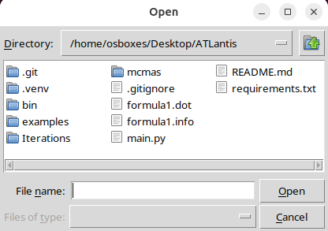
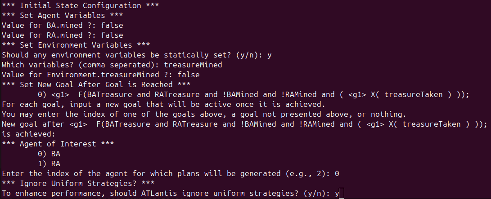
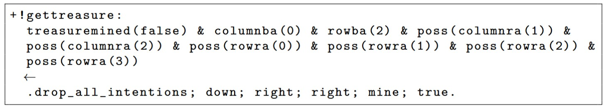

# ATLantis
A tool for generating Agent Speak plans for Belief Desire Intention (BDI) agents automatically using Alternating Time Logic (ATL).

## Prerequisites
To use ATLantis, please ensure you have the following prerequisites.

1. Python 3
2. tkinter

## Setup
The following steps should be followed before making use of ATLantis.
1. Create a Python3 virtual environment as follows.
```python3 -m venv ./.venv```

2. Active the created virtual envirenment. 
```source ./.venv/bin/activate```

3. Install pip modules as follows. 
```pip3 install -r requirements.txt```

## Using ATLantis
Using the tool involves performing the following steps.

### Step 1 - MCMAS FIle
To start ATLantis, run the following command.
```python3 main.py```

Upon starting ATLantis, you will be met with a prompt for an [MCMAS](https://sail.doc.ic.ac.uk/software/mcmas/) file. 


Example MCMAS input files can be found in the *examples* folder. 

### Step 2 - Parse Variables, Agents, and Goals
ATLantis will parse the variables, agents, and agent goals from the inputted MCMAS file.

### Step 3 - Prompt User for Additional Information

Once the MCMAS file is parsed, the user will be prompted for additional information. Example prompts can be seen in the figure below. 



In ATLantis, agent variables must be set to a fixed initial value. This is because agent variables are independent of environment variables, and should always be initialized to the same default values, regardless of the environment state.  For example, in the figure, the value *false* is assigned to the agents' internal variables.

After setting the agent variables, ATLantis will prompt the user whether any environment variables should be statically configured. As shown in figure, the *treasureMined* environment variable is set to *false* as the treasure in this example will never be mined at the start of the game. Then, the goals to be set after achieving each ATL goal are specified. In this example, no subsequent goal is provided to the ATL goal specified in the MCMAS file. This implies that no future goal should be set after obtaining the treasure. 

MCMAS allows the indistinguishability of at most one agent to be specified; all other agents are assumed to have complete certainty. As a result, ATLantis prompts the user to select the agent that will exhibit uncertainty in its environment. This is the agent that ATLantis will generate AgentSpeak plans for. In this example, agent **BA** is selected. Lastly,  the user is prompted whether ATLantis should ignore uniform strategies when verifying ATL formulas. Since uniform strategies are unlikely in games where agents have freedom of movement, we ignore them for this example.

### Step 4 - Generate Plans

After the prompts are processed, ATLantis will generate the AgentSpeak plans for the agent previously selected. As the agent provided to ATLantis can know the values of any number of variables in the system, plans must be generated for every possible combination of known variables. This was achieved through a custom algorithm that iterates through every permutation of variables an agent could know, and uses ATL to find a strategy to achieve the agent's goal given its uncertainty. 

### Step 5 - AgentSpeak Plans

When the algorithm terminates, ATLantis will output the generated AgentSpeak plans for the agent. A *.as* file will be outputted with the agent's name in the project directory. An example plan generated by ATLantis in an outputted *.as* file can be seen in the figure below.


